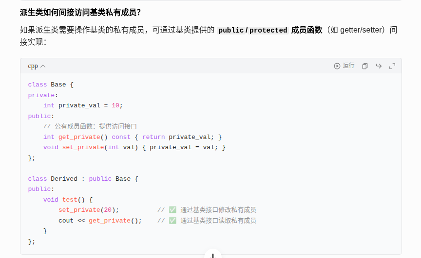

友元（Friend） 是 C++ 中一种打破封装性的语法机制，它允许一个类将其私有（private）和保护（protected）成员的访问权限，授予给外部的函数或其他类。
简单来说：友元就像类的 “好朋友”，只有被类明确指定为 “友元” 的函数或类，才能访问它的私有 / 保护成员。  

## 一、核心概念  
- 授权方：需要开放私有成员的类（通过 friend 关键字声明友元）。  
- 被授权方：获得访问权限的函数或类（可以是普通函数、其他类的成员函数，或整个类）。  
- 关键特性：友元关系是单向的（A 是 B 的友元 ≠ B 是 A 的友元），且不传递（A 是 B 的友元，B 是 C 的友元 ≠ A 是 C 的友元）。  


## 二、友元的两种类型
1. 友元函数
将一个普通函数或另一个类的成员函数声明为当前类的友元，使其能访问当前类的私有成员。  
示例：普通函数作为友元  
```cpp
class Box {
private:
    double width;  // 私有成员
public:
    Box(double w) : width(w) {}
    
    // 声明友元函数：printWidth 可以访问 Box 的私有成员
    friend void printWidth(const Box& b);
};

// 友元函数的定义（不需要加 Box::，因为它不是成员函数）
void printWidth(const Box& b) {
    cout << "Box width: " << b.width << endl;  // ✅ 直接访问私有成员 width
}

// 使用
Box myBox(10.5);
printWidth(myBox);  // 输出：Box width: 10.5
```

示例：另一个类的成员函数作为友元  
```cpp
class Box;  // 前向声明（因为 Printer 要用到 Box）

class Printer {
public:
    void printBoxWidth(const Box& b);  // 成员函数声明
};

class Box {
private:
    double width;
public:
    Box(double w) : width(w) {}
    
    // 声明 Printer 的 printBoxWidth 为友元
    friend void Printer::printBoxWidth(const Box& b);
};

// 友元成员函数的定义
void Printer::printBoxWidth(const Box& b) {
    cout << "Box width: " << b.width << endl;  // ✅ 访问 Box 的私有成员
}

// 使用
Box myBox(20.3);
Printer p;
p.printBoxWidth(myBox);  // 输出：Box width: 20.3
```

2. 友元类 
将整个类声明为当前类的友元，这样友元类的所有成员函数都能访问当前类的私有 / 保护成员。  
示例：友元类  
```cpp
class Box {
private:
    double width;
public:
    Box(double w) : width(w) {}
    
    // 声明 Printer 为友元类
    friend class Printer;
};

class Printer {
public:
    void printWidth(const Box& b) {
        cout << "Width: " << b.width << endl;  // ✅ 访问 Box 私有成员
    }
    
    void printDoubleWidth(const Box& b) {
        cout << "Double width: " << 2 * b.width << endl;  // ✅ 也能访问
    }
};

// 使用
Box myBox(5.2);
Printer p;
p.printWidth(myBox);       // 输出：Width: 5.2
p.printDoubleWidth(myBox); // 输出：Double width: 10.4
```

## 三、友元的注意事项
单向性：若 Printer 是 Box 的友元，Box 不会自动成为 Printer 的友元（除非 Printer 显式声明）。  
不传递：若 A 是 B 的友元，B 是 C 的友元，A 不会自动成为 C 的友元。  
不继承：基类的友元不会自动成为派生类的友元（除非派生类显式声明）。  
仅授予访问权：友元不会改变成员的原有访问权限（如 private 成员仍只对类自身和友元可见）。  

## 四、友元的优缺点

| 优点 | 缺点 |
| --- | --- |
| 灵活：允许特定函数 / 类跨类访问私有成员，避免过度暴露 public 接口 | 破坏封装：削弱了类的信息隐藏性，可能降低代码可维护性 |
| 高效：某些场景下（如运算符重载）用友元比用成员函数更简洁 | 难调试：友元关系分散了访问权限的控制，增加了代码复杂度 |