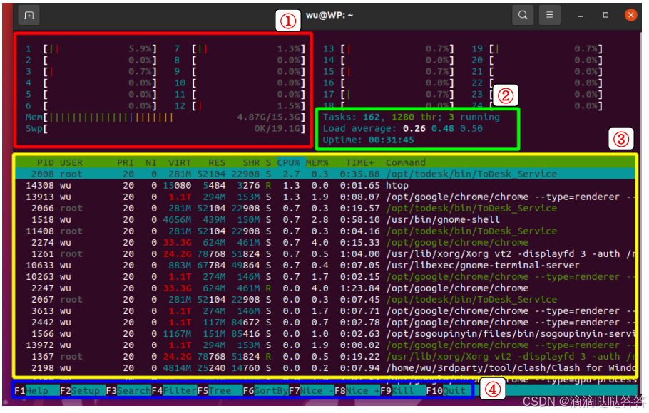

# 一、实时查看CPU和内存（Mem）利用率
工具
```bash
htop
```


## ①. 顶部状态栏（System Metrics Overview）  
这个区域显示系统的全局资源使用情况，包括:  

- **CPU 使用率**: 顶部会显示多条表示 CPU 使用情况的条形图，每条代表一个 CPU 核心。 不同颜色表示不同类型的 CPU 负载:

- **绿色**:用户进程使用的 CPU（user）
- **红色**:内核进程使用的 CPU（system）
- **蓝色**:低优先级进程使用的 CPU（nice）
- **黄色**:I/O 等待（iowait）
- **灰色**:虚拟 CPU 使用（steal time）
- **内存**（Mem）: 显示当前的物理内存使用情况，条形图及具体的数值会告诉你内存的已使用、缓存和可用内存数量。

- **交换区**（Swap）: 显示系统交换区的使用情况（如果物理内存不足时，系统会将部分数据放入交换区）。条形图和数值显示交换空间的已用和剩余量。

## ②. 任务和负载信息（Load Average and Uptime）
这个区域紧接着 CPU、内存和交换区的显示之后，主要展示以下内容:

- **任务**（Tasks）: 显示系统上正在运行的任务（进程）数量和状态信息，包括正在运行、睡眠、停止等进程数目。
- **负载平均值**（Load Average）: 显示系统的负载平均值，分别为最近1分钟、5分钟和15分钟的平均负载。
- **系统运行时间**（Uptime）: 显示系统已运行的总时间。
## ③. 进程列表（Processes List）
这是 htop 窗口中最核心的部分，显示系统中所有运行中的进程，每一行代表一个进程。每个进程行通常包含以下信息:

- **PID:** 进程的唯一标识符（进程 ID）。
- **User:** 运行该进程的用户。
- **Priority（PRI）:** 进程的优先级，数值越小，优先级越高。
- **Nice（NI）:** 进程的 nice 值，调整进程的调度优先级。
- **VIRT:** 进程虚拟内存的总量。
- **RES:** 进程实际使用的物理内存量。
- **SHR:** 进程共享内存的大小。
- **S:** 进程的状态，常见的状态有:
- **R:** Running，进程正在运行。
- **S:** Sleeping，进程在休眠状态。
- **D:** Uninterruptible sleep，无法中断的睡眠状态（通常是 I/O 操作）。
- **Z:** Zombie，僵尸进程，已终止但未清理。
- **T:** Stopped，进程已停止。
- **%CPU:** 进程当前占用的 CPU 百分比。
- **%MEM:** 进程当前占用的物理内存百分比。
- **TIME+:** 进程消耗的 CPU 总时间（格式为时:分:秒）。
- **Command:** 进程执行的命令名称或路径。
## ④. 底部功能键（Interactive Commands）
htop 提供了许多快捷键，底部通常会显示一些常用的快捷键提示:

- **F1（Help）****:** 显示帮助菜单，解释所有可用的键盘快捷键。
- **F2（Setup）:** 进入设置界面，可以调整显示颜色、排序方式等。
- **F3（Search）:** 搜索进程，可以按名称、PID 等。
- **F4（Filter）:** 过滤进程，显示符合过滤条件的进程。
- **F5（Tree）:** 以树形结构显示进程，展示进程之间的父子关系。
- **F6（Sort by）:** 选择排序方式（区域③中会以蓝色显示），比如按 CPU、内存使用量等排序。
- **F7（Nice-）:** 降低进程的优先级（增加 nice 值）。
- **F8（Nice+）:** 提高进程的优先级（减少 nice 值）。
- **F9（Kill）:** 终止选中的进程。
- **F10（Quit）:** 退出 htop。
