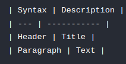

# 表格语法

要添加表，请使用三个或多个连字符（---）创建每列的标题，并使用管道（|）分隔每列。您可以选择在表的任一端添加管道。  

| Syntax      | Description |
| ----------- | ----------- |
| Header      | Title       |
| Paragraph   | Text        |

# 对齐
您可以通过在标题行中的连字符的左侧，右侧或两侧添加冒号（:），将列中的文本对齐到左侧，右侧或中心。
  
呈现的输出如下所示：
| Syntax      | Description | Test Text     |
| :---        |    :----:   |          ---: |
| Header      | Title       | Here's this   |
| Paragraph   | Text        | And more      |

# 格式化表格中的文字

 您可以在表格中设置文本格式。例如，您可以添加链接，代码（仅反引号（`）中的单词或短语，而不是代码块）和强调。

您不能添加标题，块引用，列表，水平规则，图像或HTML标签。

# 在表中转义管道字符
您可以使用表格的HTML字符代码（&#124;）在表中显示竖线（|）字符。