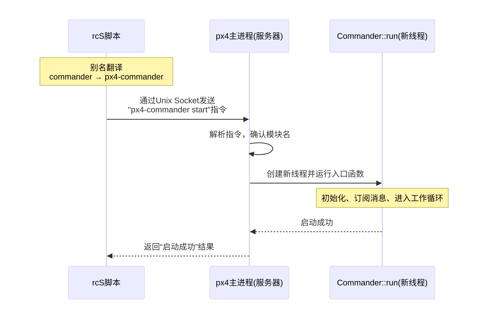

# PX4 `rcS` 脚本运行机制与语法笔记

## 1. `rcS` 脚本是什么？
`rcS` 是 PX4 启动时的主控脚本，负责初始化硬件、挂载文件系统、启动中间件和飞控应用模块。它的语法类似 Linux Shell，但底层解释器因运行平台而异。

## 2. 语法速查
| 功能 | 语法示例 | 说明 |
|------|----------|------|
| 注释 | `# 这是一行注释` | 以 `#` 开头 |
| 设置变量 | `set MODE pwm` | NuttX 下用 `set`，POSIX 下可直接 `MODE=pwm` |
| 取消变量 | `unset MODE` | |
| 引用变量 | `${MODE}` | |
| 条件判断 | `if [ $MODE == pwm ]`   `then`   `...`   `else`   `...`   `fi` | 格式类似 C，注意 `[` 前后需空格 |
| 循环 | `while ...`   `for ...` | |
| 调用子脚本 | `sh /etc/init.d/rc.sensors` | |
| 启动/停止模块 | `uorb start` `commander stop` | 直接使用模块名 |
| 挂载文件系统 | `mount -t vfat /dev/mmcsd0 /fs/microsd` | |
| 打印信息 | `echo "SD card mounted"` | |

## 3. 运行机制：NuttX vs POSIX
### 3.1 NuttX (飞控硬件，如 `fmu-v3_default`)
- **解释器**：飞控固件内置的 **NuttShell (NSH)**
- **模块映射**：模块（如 `commander`）编译为 NSH 内置命令，**无需**别名或符号链接
- **执行流程**：NSH 直接调用模块入口函数（如 `commander_main`），在 PX4 主进程内创建任务
- **特点**：全静态链接，实时性强，启动快速

### 3.2 POSIX (仿真环境，如 `px4_sitl_default`)
- **解释器**：系统 Shell (`/bin/sh`)
- **模块映射**：通过 `px4-alias.sh` 定义别名，将 `commander` 映射为 `px4-commander`
- **符号链接**：`build/px4_sitl_default/bin/px4-commander` 等文件实际是指向主程序 `px4` 的软链接
- **进程间通信**：脚本作为客户端，通过 **Unix Socket** 向已运行的 `px4` 主进程发送启动指令
- **执行流程**：`commander start` → 别名 → `px4-commander start` → Socket 发送命令 → 主进程创建线程运行 `Commander::run()`

下面是一个简化的通信示意图，以 commander start 为例：

## 4. `commander start` 启动全流程对比
| 阶段 | NuttX 硬件 | POSIX 仿真 |
|------|-----------|------------|
| 命令解析 | NSH 查找内置命令表 | Shell 别名扩展 + 符号链接 |
| 主程序 | PX4 自身即为 NSH 解释器 | `px4` 主进程已在后台运行 |
| 通信方式 | 直接函数调用 | Unix Socket 客户端-服务器通信 |
| 任务创建 | `px4_task_spawn_cmd()` 创建新线程 | 主进程收到指令后同样调用 `px4_task_spawn_cmd()` |
| 入口函数 | `commander_main(0, NULL)` | 通过 Socket 触发，主进程调用 `commander_main` |
| 实际执行 | 新线程运行 `Commander::run()` | 新线程运行 `Commander::run()` |

**`Commander::run()` 内部工作**：
- 初始化 LED、蜂鸣器等硬件
- 通过 uORB 订阅传感器、遥控器消息
- 进入循环，检查系统状态、处理指令、切换飞行模式

## 5. 为什么 `fmu-v3_default` 下没有 `px4-alias.sh`？
- `px4-alias.sh` **仅存在于 POSIX 编译目标**（仿真），因为需要让系统 Shell 识别 `commander` 等命令。
- `fmu-v3_default` 是 **NuttX 硬件固件**，所有模块都以 C/C++ 静态库形式编译进固件，命令直接注册在 NSH 中，无需外部别名文件。
- 检查方法：`ls build/px4_sitl_default/bin/` 可看到一堆 `px4-*` 软链接和 `px4-alias.sh`；而 `build/fmu-v3_default/` 下只有最终固件 `fmu-v3_default.px4` 和中间目标文件，无脚本与符号链接。

## 6. 总结
- `rcS` 脚本是一套通用初始化脚本，语法轻量，由不同平台的解释器执行。
- **POSIX 仿真**：依赖 Shell 别名 + Unix Socket 实现模块化启动，灵活性高，便于开发调试。
- **NuttX 真机**：模块为 NSH 内置命令，直接调用入口函数，无中间层，实时高效。
- 同一段 `commander start` 在这两种环境下都能运行，背后机制完全不同，但最终都会执行相同的 C++ 代码逻辑。

---

**关键文件位置**：
- POSIX 别名文件：`build/px4_sitl_default/px4-alias.sh`
- 符号链接示例：`build/px4_sitl_default/bin/px4-commander` → `px4`
- NuttX 固件输出：`build/fmu-v3_default/fmu-v3_default.px4`
- 主启动脚本：`ROMFS/px4fmu_common/init.d/rcS` (PX4 源码中)