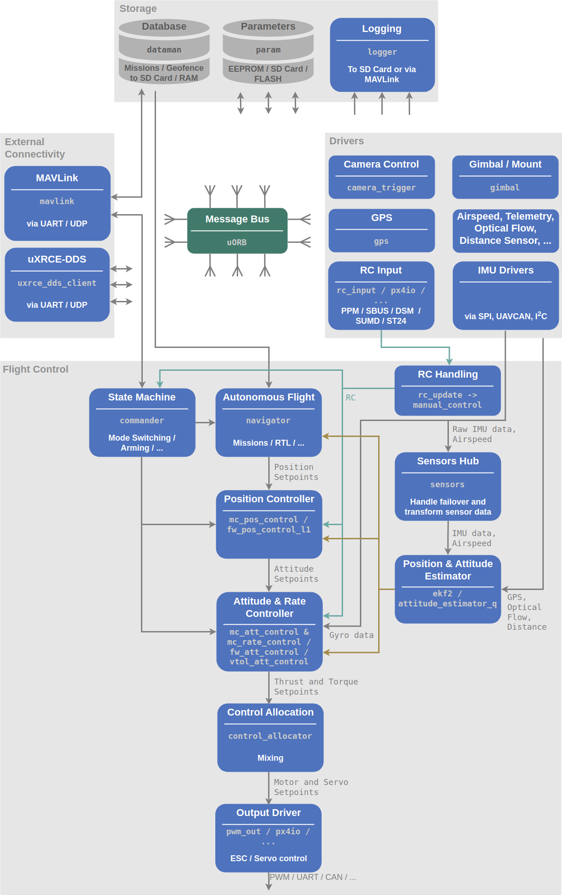
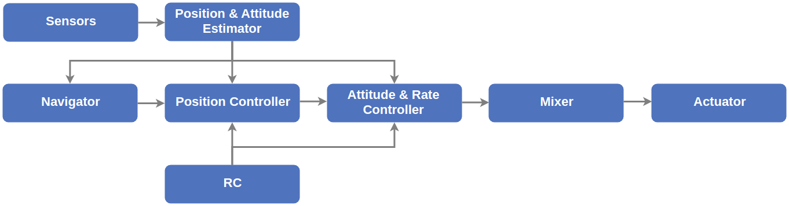

# PX4软件架构



## 飞行控制栈
     飞行控制栈是针对自主无人机设计的导航、制导和控制算法的集合。它包括了为固定翼、多旋翼和VTOL垂起无人机设计的控制器，以及相应的姿态、位置估计器。

## 中间件 
 除上图1标示的中间层具有的存储、传感器驱动、与外部设备和内部模块间通信之外，中间层还包括仿真功能，可使PX4运行在桌面操作系统下，并控制仿真环境中的无人机模型，实现对飞控程序正确性的验证。

## 运行环境
PX4可运行在提供POSIX-API的多种操作系统下（如Linux, macOS, Nuttx等），内部模块间通信的uORB机制基于共享内存，整个PX4中间层运行在单个地址空间下。

执行模块有两种不同的方式：

- 任务（Tasks）,模块在自己的任务中运行，具有自己的堆栈和进程优先级；

- 工作队列（Work Queue Tasks）,模块运行在一个共享的工作队列中，与队列上的其他模块共享相同的堆栈和工作队列线程优先级。
     - All the tasks must behave co-operatively as they cannot interrupt each other.
     - Multiple work queue tasks can run on a queue, and there can be multiple queues.
     - A work queue task is scheduled by specifying a fixed time in the future, or via uORB topic update callback.

在工作队列上运行模块的优点是它使用更少的RAM，并可能导致更少的任务切换，缺点是不允许工作队列任务对消息进行休眠或轮询，也不允许执行阻塞IO（比如从文件中读取）。长时间运行的任务（执行大量计算）应该在单独的任务中运行，或者至少在单独的工作队列中运行。

## 后台任务
px4_task_spawn_cmd() is used to launch new tasks (NuttX) or threads (POSIX - Linux/macOS) that run independently from the calling (parent) task:  
```cpp
independent_task = px4_task_spawn_cmd(
    "commander",                    // Process name
    SCHED_DEFAULT,                  // Scheduling type (RR or FIFO)
    SCHED_PRIORITY_DEFAULT + 40,    // Scheduling priority
    3600,                           // Stack size of the new task or thread
    commander_thread_main,          // Task (or thread) main function
    (char * const *)&argv[0]        // Void pointer to pass to the new task
                                    // (here the commandline arguments).
    );
```