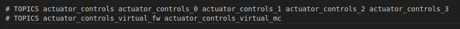

# uORB通讯
uORB 是一种异步的 publish()（发布）/ subscribe()（订阅）消息传递 API，用于线程间/进程间通信。

# 添加新 Topic（主题）
- 新的uORB主题可以通过在主PX4/Firmware 存储库中添加，也能通过在树外（out-of-tree）消息定义中添加。  
- 要添加新主题，你需要在 msg/ 目录中创建一个新的 .msg 文件，并将文件名添加到 msg/CMakeLists.txt 列表中。 这样，将自动生成所需的 C/C++ 代码。
- 查看现有的 msg 文件以了解支持的类型。 消息还可以在其他消息中嵌套使用。

- 对于每个生成的 C/C++ 结构体，将添加一个字段 uint64_t timestamp。 这用于记录日志，因此请确保在发布时填充数据。
  
- 若要在代码中使用该主题，请包含头文件：
  假设前面创建的msg文件名为topic_name，或者包含已有的msg消息头文件
    ```cpp
    #include <uORB/topics/topic_name.h>
    ```
- 通过在 .msg 文件中添加如下一行内容，单个消息定义可用于多个独立主题：
  ```
    # TOPICS mission offboard_mission onboard_mission
  ```
- 然后在代码中，将它们用作主题 ID：ORB_ID(offboard_mission)。

    这个TOPICS的用在电机消息示例如下：
    

## 独立数据源
**核心目的：** 解决系统中存在**多个相同类型的数据源**（如多个IMU、多个电池）时，避免为每个源创建**冗余且几乎完全相同的 .msg 文件**的问题。

### 关键机制：

1. 添加特殊字段： 在需要支持多实例的 .msg 文件定义中，添加一行 uint16 topic_id。

2. 动态主题创建： 当模块使用 orb_advertise_multi() 发布此类型消息时：

uORB 系统会根据请求的 instance（实例号），动态创建基于基础主题名的 逻辑主题 (如 sensor_imu[0], sensor_imu[1]）。

系统自动将当前发布操作对应的 实例号 填充到该消息的 topic_id 字段中。

3. 发布与订阅：

- 发布者： 通过 orb_advertise_multi() 获取或指定实例号，然后发布消息。消息自动携带标识其来源实例的 topic_id。

- 订阅者：
  - 可以订阅特定实例 (如 sensor_imu[1]) 只接收该源的数据。

  - 可以订阅基础主题 (如 sensor_imu)，接收所有实例的数据，并通过消息中的 topic_id 字段区分数据来自哪个具体源。

### 核心好处：

1。 消除冗余： 只需一个 .msg 文件 即可支持无限多个同类型独立数据源（主题实例），无需为每个源创建单独的消息定义文件。

2. 简化维护： 修改消息结构（增删字段）只需修改一个 .msg 文件，所有使用该消息类型的实例自动生效。

3. 优雅支持多实例： 天然支持系统中存在多个相同功能组件（传感器、控制器等）的场景，是 PX4 实现传感器冗余、多电池管理、模块多实例化等特性的基础通信机制。

4. topic_id 的作用： 这是实现该机制的核心。它由 uORB 系统在发布时自动填充，携带了标识数据来源实例的关键信息，使接收方能区分不同物理源的数据。

### test{#1}


## another
[head ids](#test1)