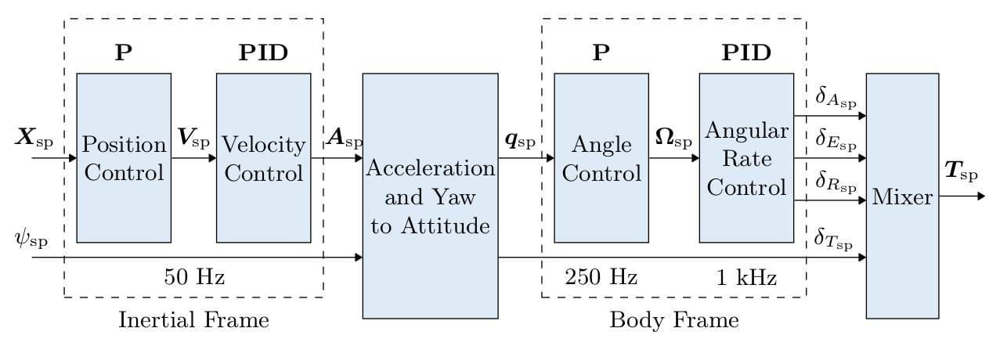
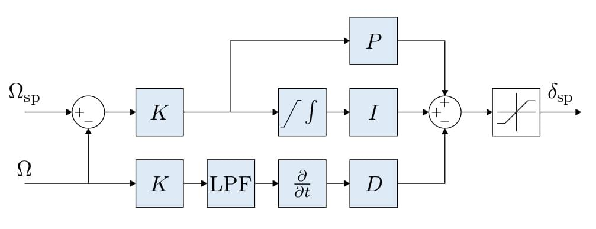
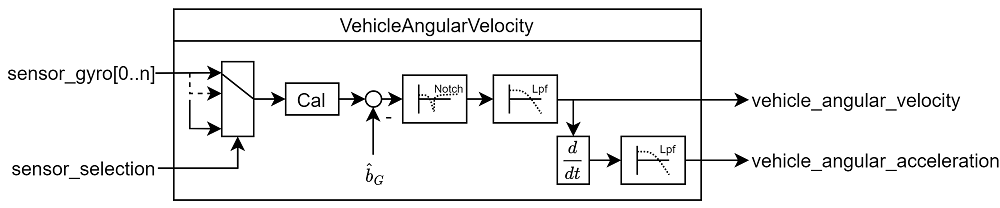
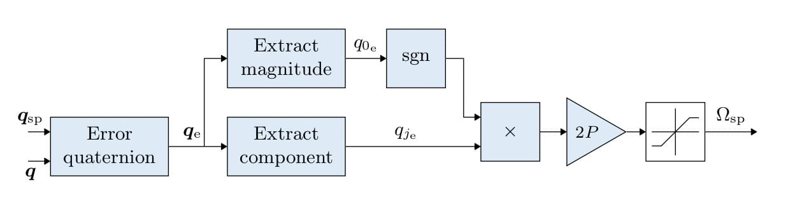
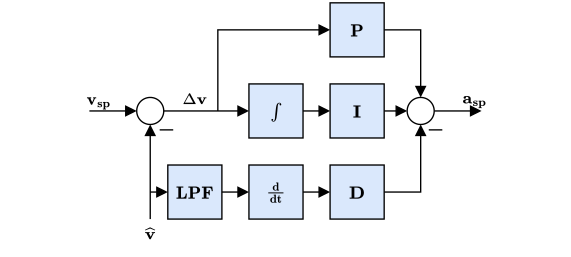
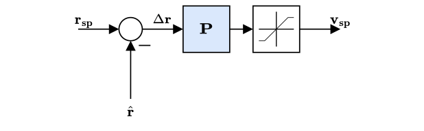
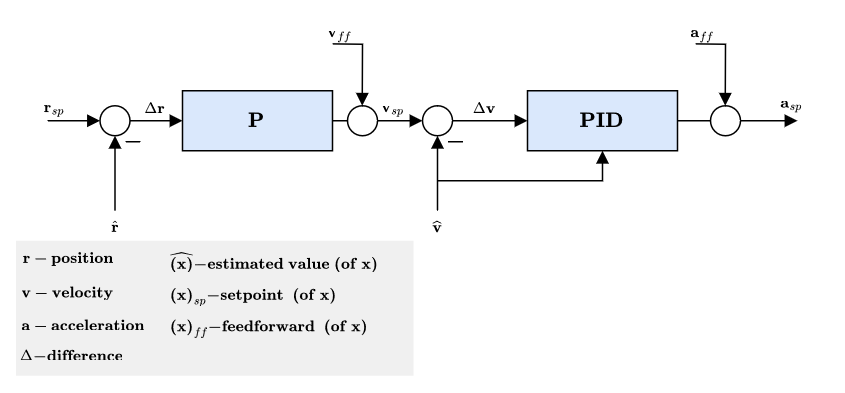

# **控制器图解**

# 多旋翼的控制架构

- 这是一个标准的级联控制架构。  
- 控制器采用P和PID控制的组合方式。   
- Estimates come from EKF2.  
- 在某些模式下，外环(位置回路) 可能会被绕过 (在图中表示为外环之后增加一个多路开关)。 只有在位置保持模式或某轴无速度请求时，位置回路才会发挥作用。  

# 多旋翼角速率控制器

- 采用K-PID控制器。 See Rate Controller for more information.

- 为了防止积分饱和，积分环节的权重是受限的，

- The outputs are limited (in the control allocation module), usually at -1 and 1.

- A Low Pass Filter (LPF) is used on the derivative path to reduce noise (the gyro driver provides a filtered derivative to the controller). 即PID中的D项没有采用误差的微分，而是采用状态的微分。

> INFO
> The IMU pipeline is: gyro data > apply calibration parameters > remove estimated bias > notch filter (IMU_GYRO_NF0_BW and > > IMU_GYRO_NF0_FRQ) > low-pass filter (IMU_GYRO_CUTOFF) > vehicle_angular_velocity (filtered angular rate used by the P and I controllers) > derivative -> low-pass filter (IMU_DGYRO_CUTOFF) > vehicle_angular_acceleration (filtered angular acceleration used by the D controller)
> 

# 多旋翼姿态控制器

- 姿态控制器使用四元数作为输入
- The controller is implemented from this article.
- 当你调整这个控制器时，唯一需要考虑的参数是增益 P。
- 输出的角速率命令是饱和的。

# 多旋翼加速度转换为推力与姿态设定点
- 由速度控制器生成的加速度设定点将会被转换为推力和姿态设定点
- 转换后的加速度设定点将在垂直和水平推力方向进行限幅与优先级划分。
- 推力限幅在执行推力计算后完成：
    1. Compute required vertical thrust (thrust_z)
    2. Saturate thrust_z with MPC_THR_MAX
    3. Saturate thrust_xy with (MPC_THR_MAX^2 - thrust_z^2)^0.5

# 多旋翼速度控制器

- 采用PID控制器来稳定速度。 该控制器输出的命令是加速度。
积分器包括了一个采用钳制方法的反复位饱和措施。
- The commanded acceleration is NOT saturated - a saturation will be applied to the converted thrust setpoints in combination with the maximum tilt angle.
- Horizontal gains set via parameter MPC_XY_VEL_P_ACC, MPC_XY_VEL_I_ACC and MPC_XY_VEL_D_ACC.
- Vertical gains set via parameter MPC_Z_VEL_P_ACC, MPC_Z_VEL_I_ACC and MPC_Z_VEL_D_ACC.

# 多旋翼位置控制器

- 采用简单的P控制器来控制速度。
- 输出的速度命令是饱和的，目的是保持一定的速度限制。 See parameter MPC_XY_VEL_MAX. This parameter sets the maximum possible horizontal velocity. This differs from the maximum desired speed MPC_XY_CRUISE (autonomous modes) and MPC_VEL_MANUAL (manual position control mode).
- Horizontal P gain set via parameter MPC_XY_P.
- Vertical P gain set via parameter MPC_Z_P.

# 静态力矩 (PI) 缩放补偿

- 模式相关前馈（ff） ——例如：任务模式轨迹生成器（加加速度受限轨迹）计算位置、速度及加速度设定点。

- 加速度设定点（惯性坐标系）将结合偏航角设定点，转换至姿态设定点（四元数）及总推力设定点。

# 固定翼位置控制器
略