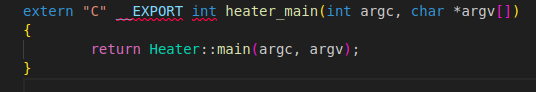
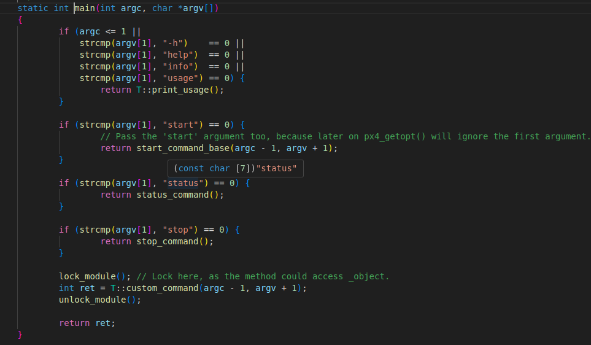
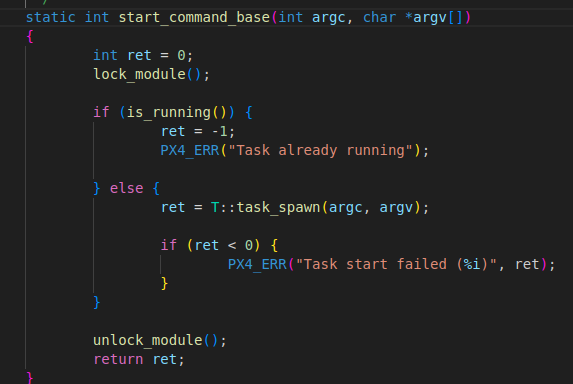
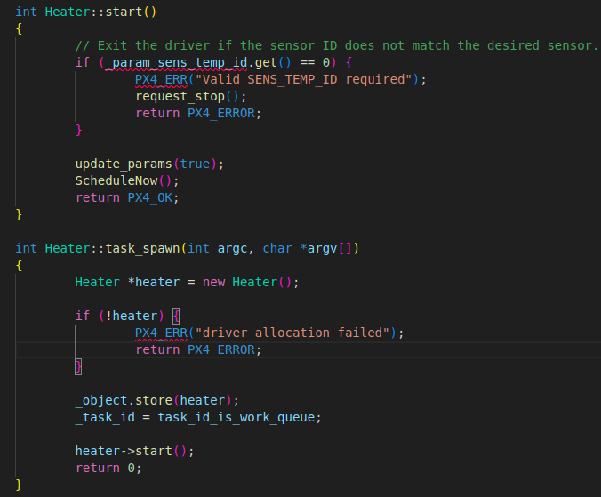

# 概览
每个模块（包括modules、drivers）都有start、stop、status以及print_usage()方法等等，故脚本文件也是通过start方法来启动各个模块


# PX4模块入口函数`xxx_main`的实现模式
在PX4中，模块或驱动程序的入口点通常以`xxx_main.cpp`文件形式存在，其中`xxx_main`函数是模块执行的起点。根据模块的功能需求（如是否需要后台运行、是否支持多实例等）和框架抽象的不同，存在多种实现模式。
## 1. 直接调用静态`main()`方法（阻塞/运行服务模式）
### 实现方式
```cpp
extern "C" __EXPORT int xxx_main(int argc, char *argv[])
{
    return ClassName::main(argc, argv);
}
```


### 代码流程
```cpp
xxx_main ->class T::main() -> start_command_base() -> T::task_spawn -> start()
```
#### 入口函数


#### 类模板，ModuleBase类中，例如Heater::main()中在如下函数中，Heater会替代T


#### 启动task_spawn()


#### 进入task_spawn()后创建出实例，然后存储，最后通过start函数启动任务


### 特点
- `xxx_main`仅作为包装，立即调用模块类`ClassName`的静态`main`方法。
- 静态`main`方法负责参数解析、创建实例、运行阻塞循环（通常调用`run()`方法）。
### 适用场景
- 长期运行的服务（如传感器数据采集、姿态估计、位置控制、通信链路）。
- 需要复杂初始化或阻塞循环的任务。
### 原因
- 简洁直接，入口点代码最少。
- 核心逻辑封装在C++类中，符合面向对象设计。
- 通常内部使用`runModule`或`run_trampoline`等框架函数启动阻塞循环。
---
## 2. 基于`ModuleBase`/`ModuleCommand`的命令分发模式
### 实现方式
```cpp
extern "C" __EXPORT int xxx_main(int argc, char *argv[])
{
    const char *verb = cli.consume_string(); // 获取第一个参数（如'start', 'stop'）
    if (!verb) {
        ThisDriver::print_usage();
        return -1;
    }
    // 尝试获取已存在的实例（可选）
    ModuleBase *instance = ThisDriver::instantiate(cli, iterator);
    if (!strcmp(verb, "start")) {
        return instance ? instance->module_start(cli, iterator) : ThisDriver::module_start(cli, iterator);
    }
    if (!strcmp(verb, "stop")) {
        return instance ? instance->module_stop(cli, iterator) : ThisDriver::module_stop(cli, iterator);
    }
    // 其他命令（status, info等）处理...
}
```
### 代码流程
```cpp
xxx_main() -> ThisDriver::module_start(cli, iterator) -> I2CSPIDriverBase::module_start(cli, iterator, &T::print_usage, InstantiateHelper<T>::m)
```

### 特点
- 入口函数解析第一个参数（`verb`），根据不同的命令调用模块的静态方法（如`module_start`, `module_stop`）。
- `module_start`负责创建实例并启动（可能调用`run()`或注册到工作队列），`module_stop`负责停止并销毁实例。
### 适用场景
- 驱动程序（如PWM输出、RGB LED、蜂鸣器）。
- 需要显式启动/停止控制的服务。
- 支持多实例的模块。
### 原因
- 提供标准Unix风格命令接口（`start`/`stop`/`status`），用户体验一致。
- 集中处理命令分发，静态方法专注于具体操作。
- 明确分离实例生命周期管理（创建/销毁）和运行逻辑。
- 便于支持多实例（`module_start`可创建多个实例，`module_stop`指定停止哪个）。
- 框架类`ModuleCommand`封装了常见样板代码。
---
## 3. 基于`WorkItem`/`ScheduledWorkItem`的入口（任务调度模式）
### 实现方式
```cpp
extern "C" __EXPORT int xxx_main(int argc, char *argv[])
{
    return WorkItemExample::main(argc, argv);
}
// 在类WorkItemExample中：
int WorkItemExample::main(int argc, char *argv[])
{
    if (argc < 2) {
        PRINT_MODULE_USAGE;
        return PX4_ERROR;
    }
    if (!strcmp(argv[1], "start")) {
        return WorkItemExample::instantiate(); // 创建实例并调度
    }
    if (!strcmp(argv[1], "stop")) {
        return WorkItemExample::stop(); // 停止实例
    }
    // ...其他命令
}
// 实例化并调度
int WorkItemExample::instantiate()
{
    WorkItemExample *instance = new WorkItemExample();
    if (instance) {
        instance->ScheduleNow(); // 立即调度（首次）
        return PX4_OK;
    }
    return PX4_ERROR;
}
// 重写run方法（周期性执行）
void WorkItemExample::run()
{
    // 模块主要逻辑
    ScheduleDelayed(10000); // 10ms后再次调度
}
```
### 特点
- 入口点调用类静态`main`方法进行命令分发（类似模式2）。
- 模块类**继承自`ScheduledWorkItem`**，重写`run()`方法实现逻辑。
- 通过`ScheduleNow()`或`ScheduleDelayed()`将任务提交到工作队列线程池，无需内部阻塞循环。
### 适用场景
- 需要周期性执行但无需独占线程的任务（现代PX4推荐模式）。
- 传感器处理、数据融合步骤、周期性状态更新。
### 原因
- **高效利用资源**：共享工作线程，减少线程创建/切换开销。
- **简化并发**：工作队列处理线程调度和同步。
- **框架演进**：替代旧式独立线程模式，提高系统可扩展性。
---
## 4. 直接执行工具命令模式（一次性工具）
### 实现方式
```cpp
extern "C" __EXPORT int xxx_main(int argc, char *argv[])
{
    MyTool tool; // 在栈上创建工具对象
    return tool.main(argc, argv); // 执行后退出
}
// 或使用静态方法
extern "C" __EXPORT int xxx_main(int argc, char *argv[])
{
    return MyTool::main(argc, argv);
}
```
### 特点
- 入口函数直接创建工具对象或调用静态方法。
- 执行特定操作（配置、测试、查询）后立即退出，无后台循环。
### 适用场景
- 配置工具（如`param`, `reboot`）。
- 诊断/测试工具（如`perf`, `listener`, 单元测试）。
- 一次性计算任务。
### 原因
- 简单高效，适用于不需要持续运行的操作。
- 执行后立即释放资源。
---
## 多种模式存在的原因总结
1. **功能需求差异**：
   - 长期服务 vs 一次性工具。
   - 生命周期管理（是否需要`start`/`stop`）。
   - 并发模型（独占线程、工作队列共享、无线程）。
   - 多实例支持需求。
2. **框架抽象与演进**：
   - 历史代码（独立线程阻塞循环） vs 现代抽象（`WorkItem`, `ModuleCommand`）。
   - 基类（如`ModuleCommand`, `ScheduledWorkItem`）封装通用逻辑，减少重复代码。
   - 性能优化（工作队列模式减少线程数量）。
3. **清晰性与封装性**：
   - 模式1：逻辑完全封装在类中，入口极简。
   - 模式2：命令分发和生命周期管理清晰可见。
   - 模式3：明确任务调度模型。
   - 模式4：简单处理一次性任务。
## 模式选择建议
- **长期运行**：
  - 需共享线程 → **模式3（`WorkItem`）**。
  - 驱动/需标准命令 → **模式2（`ModuleCommand`风格）**。
  - 简单/历史模块 → **模式1（直接调用`Class::main`）**。
- **一次性执行** → **模式4（工具命令）**。
> 注意：随着PX4发展，模式2和模式3（基于`ModuleCommand`和`WorkItem`）已成为新模块的首选，尤其是驱动和周期性任务。 
