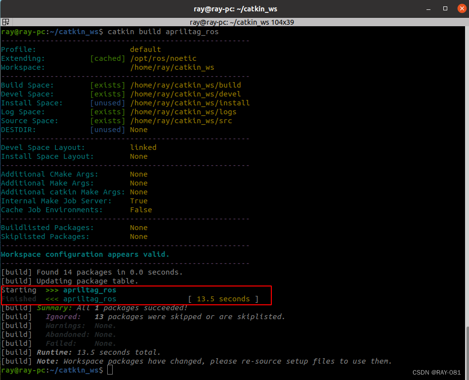
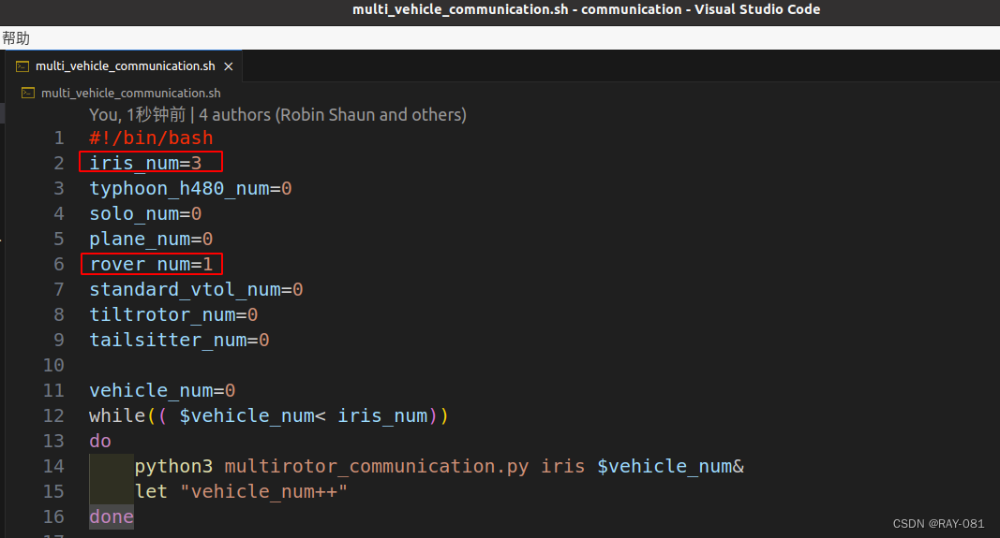
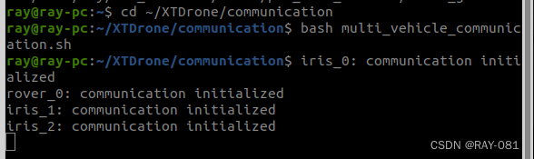
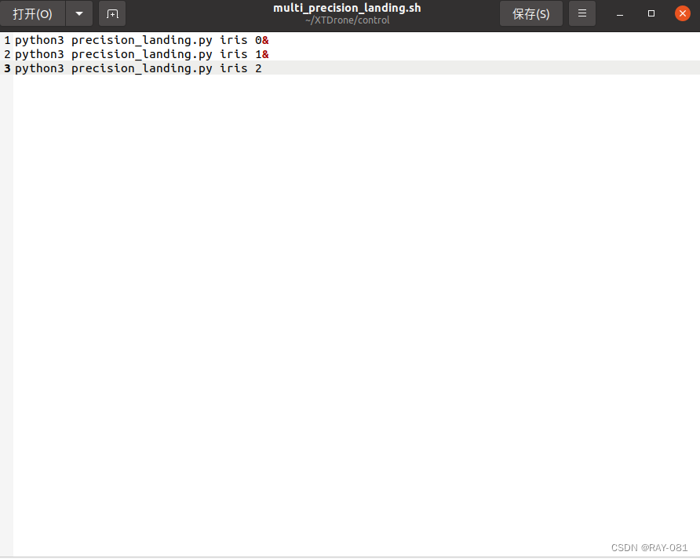

# 启动流程
## 预先流程

1. 首先先克隆好XTDrone的源码，然后创建好自己的工作空间catkin_ws，并编译。
2. 安装好Vscode。
3. 克隆PX4并下载好子模块、依赖。
4. 安装好ROS、mavros、gazebo。
5. 在~/.bashrc中配置好工作空间、ROS、PX4的环境变量。
6. 配置好XTDrone的基础设置

## 编译AprilTag_ROS  

AprilTag是一个视觉基准系统，可用于机器人，增强现实和相机校准等。 根据AprilTag可以可靠地计算标签相对于相机的3D位置，方向和ID号。这里我们使用AprilTag的ROS库来实现位姿估计与ID号计算。
```bash
sudo apt install ros-noetic-apriltag  # 根据自己的ROS版本来修改
cp -r ~/XTDrone/sensing/object_detection_and_tracking/apriltag/apriltag_ros/ ~/catkin_ws/src/
cd ~/catkin_ws/
catkin build apriltag_ros #或catkin_make
```  
编译成功后，显示如下：
  

这一步是编译好AprilTag的功能包，用于后续识别使用。至于带有AprilTag的模型车，XTDrone团队已经制作好了。

## 配置PX4
在之前的任务中，我们没有让PX4 SITL发布过TF，一切坐标系转换都是依靠订阅话题+手工代码转换，由于在精准降落问题中，涉及到地图坐标系（map）、无人机坐标系（base_link）、相机坐标系（camera_link）和**AprilTag坐标系**（tag）四类坐标系，因此手工代码转换比较繁琐，因此我们借助ROS的TF工具来帮助我们进行转换。由于MAVROS默认不发布TF，且默认定义的坐标系不带namespace，也就是iris_0还是iris_1的机体坐标系都叫base_link，因此我们需要进行修改。   

复制XTDrone的px4.launch以及三个配置文件px4_config_iris_0.yaml等，放入
```bash
sudo cp ~/XTDrone/sitl_config/launch/px4/*  /opt/ros/noetic/share/mavros/launch/
```
此次使用的仿真launch文件，在mavros中指定了px4_config文件的名字
```bash
<include file="$(find mavros)/launch/px4.launch">
    <arg name="fcu_url" value="$(arg fcu_url)"/>
    <arg name="gcs_url" value=""/>
    <arg name="tgt_system" value="$(eval 1 + arg('ID'))"/>
    <arg name="tgt_component" value="1"/>
    <arg name="config_yaml" value="$(find mavros)/launch/px4_config_iris_0.yaml"/>
</include>
```

## 修改EKF2设置
由于需要机体在Gazebo的地图坐标系下的位姿，因此定位需要使用Gazebo真值，此外使用Gazebo真值定位的精度也更高，便于事先精准降落。注意事先要修改EKF2设置，改为视觉定位模式。  

PX4默认使用的EKF配置为融合GPS的水平位置与气压计高度。如果我们想使用视觉定位，就需要把修改配置文件。  
    注意，此修改意味着EKF融合来自mavros/vision_pose/pose的数据，并不是修改完无人机就可以视觉定位了，需要相关程序提供mavros/vision_pose/pose的数据，相关程序包括视觉SLAM、激光SLAM和获取Gazebo真值等。如果没有额外的视觉数据，想要飞行必须改回基于GPS和气压计的定位。一般情况下，自主飞行的无人机需要有位姿数据，查看/xxx_xx/mavros/local_position/pose应该有正确的数据。

1. 打开rcS配置文件
PX4 v1.11版本(v1.11版本可以直接修改rcS文件)   
```bash
    code ~/PX4_Firmware/ROMFS/px4fmu_common/init.d-posix/rcS
```

PX4 v1.13版本(1.13版本的参数修改需要修改编译后的文件才能生效。**如果按照1.11版本的方法修改则需要重新编译**。
在此我们直接修改编译后的rcS文件)   

2. 修改参数
通过注释来修改不同的参数
```bash
# GPS used
#param set EKF2_AID_MASK 1
# Vision used and GPS denied
param set EKF2_AID_MASK 24

# Barometer used for hight measurement
#param set EKF2_HGT_MODE 0
# Barometer denied and vision used for hight measurement
param set EKF2_HGT_MODE 3
```
3. 删除原参数配置文件
重启仿真前，需要删除上一次记录在虚拟eeprom中的参数文件，否则仿真程序会读取该参数文件，导致本次rcS的修改不能生效。（这一步是建立在我们不需要重新编译的前提下）
```bash
rm ~/.ros/eeprom/parameters*
rm -rf ~/.ros/sitl*
```

## 启动仿真
1. 修改outdoor2_precision_landing.launch文件
官方提供的<param>标签使用的是旧的命令格式，xacro命令的路径和参数配置上运行时会报错。  
解决方法：去掉launch文件中<param>标签中xacro.py的.py  
修改后的outdoor2_precision_landing.launch文件(该文件的目录：  
/home/你的主机名/PX4_Firmware/launch)  

若修改后还报错，输入如下命令检查是否安装xacro
```bash
which xacro
```

2. 启动仿真
```bash
roslaunch px4 outdoor2_precision_landing.launch 
```
正常启动后会发现不断报错，这是因为mavros的base_link_frd坐标系找不到base_link，因为我们给base_link加了namespace，不过这个错误不影响使用，不用理会。以下报错信息可能会不同，但意思都是一样的。
```
[ERROR] [1617509823.832162747, 3.666000000]: ODOM: Ex: Could not find a connection between 'iris_0/base_link' and 'base_link_frd' because they are not part of the same tree.Tf has two or more unconnected trees.
```

## 启动多机通信
该脚本为前面的每个无人机和无人车发布和订阅节点，并启动服务。
1. 修改multi_vehicle_communication.sh脚本
由于启动了3架iris无人机和1辆rover汽车，所以需要对multi_vehicle_communication.sh文件进行如下修改并保存。


2. 启动多机通信脚本
```bash
cd ~/XTDrone/communication
bash multi_vehicle_communication.sh
```
通信启动成功后显示如下：

## 启动获取位姿脚本
```bash
cd ~/XTDrone/sensing/pose_ground_truth/
python3 get_local_pose.py iris 3
```

## 启动键盘控制
这个脚本后面的步骤会使用，目的是控制无人机起飞到无人车的上方，确保可以识别到AprilTag。下面的精准降落脚本只负责降落。
```bash
cd ~/XTDrone/control/keyboard
python3 multirotor_keyboard_control.py iris 3 vel
```

## 启动apriltag_ros
```bash
roslaunch apriltag_ros xtdrone_detection.launch
```

## 使用rviz进行可视化
```bash
cd ~/XTDrone/sensing/object_detection_and_tracking/apriltag/apriltag_ros/config
rviz -d rviz.rviz
```

## 控制三架无人机到无人车的上方
在之前的键盘控制脚本的终端下控制无人机起飞到无人车的上方
先按g进入多机控制模式,然后按i增加向上的速度，之后按b进入offboard模式，随后按t解锁，无人机将会往上飞，待飞到一定高度，在rviz中的Image界面能看到apriltag时，按s使得无人机悬停。然后关闭键盘控制脚本。

## 启动多机精准降落脚本
在启动multi_precision_landing.sh脚本之前，先对原脚本进行修改，用python3来启动

```bash
cd ~/XTDrone/control/
bash multi_precision_landing.sh 
```

## 后续
降落之后可能由于撞击产生的振动，PX4的状态估计会出错，在RVIZ上看就是飞机的坐标系突然乱动，可能飞机还会乱飞。不过没关系，已经完成了降落，任务已经完成。

目前这个方案还无法实现车辆在运动过程中的降落，因为飞机在距离AprilTag较近时，就无法识别了。如果想要更好的跟踪降落，需要在AprilTag中嵌套一个更小的AprilTag