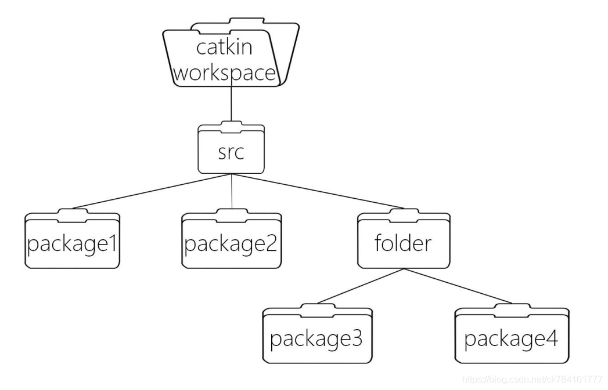
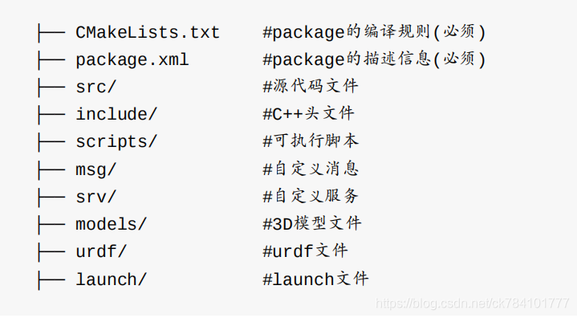

## 扫盲
1. 工作空间
工作空间（work space）是ROS系统中存放工程开发相关的文件夹，其目录结构如下：

    src：代码空间（Source Space），用于存放开发代码

    build：编译空间（Build Space），catkin（CMake）的缓存信息和中间文件

    devel：开发空间（Development Space），生成的目标文件（包括头文件，动态链接库，静态链接库，可执行文件等）、环

    境变量
    install：安装空间（Install Space）

一个最小的项目结构如图所示：


后两个路径由 catkin 系统自动生成、管理，我们日常的开发一般不会去涉及，而主要用到的是src文件夹，我们写的 ROS 程序、网上下载的 ROS 源代码包都存放在这里。 在编译时，catkin 编译系统会递归的查找和编译 src/ 下的每一个源代码包。因此你也可以把几个源代码包放到同一个文件夹下，如下图所示：



## 若没有创建工作空间，则需要先创建一个工作空间
1. 创建文件夹
```bash
mkdir -p catkin_ws/src
cd catkin_ws/src
```
2. 初始化工作空间(在src目录下)，即生成CmakeList.txt文件
```bash
catkin_init_workspace
```
3. 编译工作空间（暂时还没有创建功能包）
    ```
    cd ~/catkin_ws
    catkin_make 
    ```
4. 设置环境变量
    ```
    vim ~/.bashrc
    #将下列代码写入.bashrc
    souce ~/catkiin_ws/devel/setup.bash
    ```
    这里使用的是setup.bash,还有两个文件为setup.sh和setup.zsh，要source哪个文件取决于你的默认解释程序（echo $SHELL）
## 补充：工作空间的覆盖
当你source多个工作路径时，ROS的查找机制。

    1）工作空间的路径记录在ROS_PACKAGE_PATH环境变量中

    2）新设置的路径（source后）会放在ROS_PACKAGE_PATH变量的最前端

    3）运行程序时，ROS会优先在靠近前端的工作空间中查找指定的功能包

    4）只有当前端工作空间不存在该功能包时才向后查找

## 功能包（package）
ROS中的package不仅是Linux上的软件包，
更是catkin编译的基本单元，我们调用 catkin_make 编译的对象就是一个个ROS的package，也就是说任何ROS程序只有组织成package才能编译 。所以 package 也是 ROS 源代码存放的地方，任何 ROS 的代码无论是 C++ 还是Python 都要放到 package 中，这样才能正常的编译和运行。

1. 创建功能包
    ```bash
    cd ~/catkin_ws/src
    catkin_create_pkg test1 rospy roscpp std_msgs
    cd ~/catkin_ws
    catkin_make
    source devel/setup.bash #如果之前在.bashrc中配置了可不用这一步
    ```
catkin_create_pkg指令第一个参数test1是创建的功能包文件夹名称，后面的参数rospy roscpp是所需的依赖
补充：如果是第三方下载的，如需进行catkin_create_pkg，直接执行catkin_make编译即可，因为第三方已经配置好了。

## ros功能包的目录结构
一个功能包的目录结构如下，CmakeLists.txt和package.xml是必须的，分别定义编译规则和描述信息。</b>
其他类似src、include、scripts这些目录命名都是约定俗成的，并未明确定义，但是ros默认会去这些目录下找相关文件，所以为了标准化，请规范命名
更加详细的描述如下:

    CMakeLists.txt: 定义package的包名、依赖、源文件、目标文件等编译规则，是package
    不可少的成分
    package.xml: 描述package的包名、版本号、作者、依赖等信息，是package不可少的成
    分
    src/: 存放ROS的源代码，包括C++的源码和(.cpp)以及Python的module(.py)
    include/: 存放C++源码对应的头文件
    scripts/: 存放可执行脚本，例如shell脚本(.sh)、Python脚本(.py)
    msg/: 存放自定义格式的消息(.msg)
    srv/: 存放自定义格式的服务(.srv)
    models/: 存放机器人或仿真场景的3D模型(.sda, .stl, .dae等)
    urdf/: 存放机器人的模型描述(.urdf或.xacro)
    launch/: 存放launch文件(.launch或.xml)
注意：同一个工作空间不能存在相同名称的功能包，不同工作空间可以存在相同名称的功能包 

功能包命令
1. rospack
rospack 是对 package 管理的工具，命令的用法如下：  
    rospack list ：列出本机所有package   
    rospack depends [package] ：显示package的依赖包  
    rospack find [package] ：定位某个package  
    rospack profile ：刷新所有package的位置记录  


2. roscd 
roscd 命令类似与 Linux 系统的 cd ，改进之处在于 roscd 可以直接 cd 到 ROS 的软件包。  
    roscd [package]：cd到ROS Package的目录
补充：使用前必须source空间

3. rosdep </b>  
rosdep 是用于管理ROS package依赖项的命令行工具，用法如下：  
    rosdep check [pacakge] ：检查package的依赖是否满足  
    rosdep install [pacakge] ：安装pacakge的依赖  
    rosdep db ：生成和显示依赖数据库  
    rosdep init ：初始化/etc/ros/rosdep中的源  
    rosdep keys ：检查package的依赖是否满足  
    rosdep update ：更新本地的rosdep数据库  

## 参考文献
https://blog.csdn.net/ck784101777/article/details/106297924