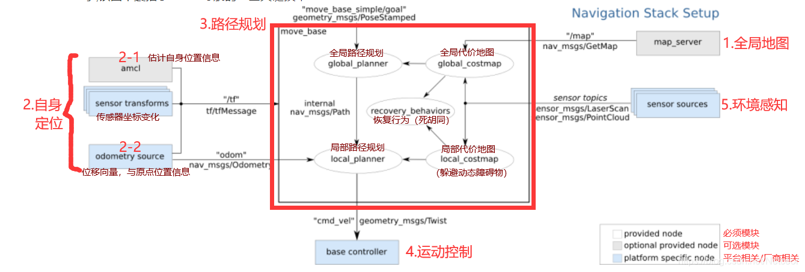

矩形框代表节点

参考博客 https://blog.csdn.net/Netceor/article/details/118997851  

### **（1）全局地图**  
（全局概览图：定位+路径规划）

- SLAM（实现地图构建和即时定位）,也称为CML (Concurrent Mapping and Localization), 即时定位与地图构建，或并发建图与定位。SLAM问题可以描述为: 机器人在未知环境中从一个未知位置开始移动,在移动过程中根据位置估计和地图进行自身定位，同时在自身定位的基础上建造增量式地图，以绘制出外部环境的完全地图。（如红警起始一片黑，随着摸索出现地图）

ROS中保存地图的功能包是 map_server

- 传感器：如果要完成 SLAM ，机器人必须要具备感知外界环境的能力，尤其是要具备获取周围环境深度信息的能力。感知的实现需要依赖于传感器，比如: 激光雷达、摄像头、RGB-D摄像头

### **（2）自身定位**
（确定在地图中的位置）

- amcl(adaptiveMonteCarloLocalization)自适应的蒙特卡洛定位,是用于2D移动机器人的概率定位系统。它实现了自适应（或KLD采样）蒙特卡洛定位方法，该方法使用粒子过滤器根据已知地图跟踪机器人的姿态。
- 导航开始和导航过程中，机器人都需要确定当前自身的位置，室外可用GPS。室内、隧道、地下或一些特殊的屏蔽和弱化 GPS 信号的区域，前面的 SLAM 就可以实现自身定位，除此之外，ROS 中还提供了一个用于定位的功能包amcl
### **（3）路径规划**
（全局+局部路径规划）

- 全局路径规划(gloable_planner)

根据给定的目标点和全局地图实现总体的路径规划，使用 Dijkstra 或 A* 算法进行全局路径规划，计算最优路线，作为全局路线

- 局部路径规划(local_planner)

在实际导航过程中，机器人可能无法按照给定的全局最优路线运行，比如:机器人在运行中，可能会随时出现一定的障碍物... 本地规划的作用就是使用一定算法(Dynamic Window Approaches) 来实现障碍物的规避，并选取当前最优路径以尽量符合全局最优路径

### **（4）运动控制**
（控制速度和方向）

 - 导航功能包集假定它可以通过话题"cmd_vel"发布geometry_msgs/Twist类型的消息，这个消息基于机器人的基座坐标系，它传递的是运动命令。这意味着必须有一个节点订阅"cmd_vel"话题， 将该话题上的速度命令转换为电机命令并发送。

### **（5）环境感知**
（感知周围环境）  

感知周围环境信息，比如: 摄像头、激光雷达、编码器...，摄像头、激光雷达可以用于感知外界环境的深度信息，编码器可以感知电机的转速信息，进而可以获取速度信息并生成里程计信息。

在导航功能包集中，环境感知也是一重要模块实现，它为其他模块提供了支持。其他模块诸如: SLAM、amcl、move_base 都需要依赖于环境感知。

###  2.坐标系
**（1）里程计定位（odom）**  
里程计定位：时时收集机器人的速度信息，计算并发布机器人坐标系与父级参考系的相对关系。
优点：里程计定位信息是连续的，没有离散的跳跃。
缺点：里程计存在累计误差，不利于长距离或长期定位。
【根据自己向什么方向走了多少路判断位置】

**（2）传感器定位（map）  **
传感器定位：通过传感器收集外界环境信息通过匹配计算并发布机器人坐标系与父级参考系的相对关系。
优点：比里程计定位更精准；
缺点：传感器定位会出现跳变的情况，且传感器定位在标志物较少的环境下，其定位精度会大打折扣。
 【根据自己周围环境判断位置】

**（3）坐标系变换**
上述两种定位实现中，机器人坐标系一般使用机器人模型中的根坐标系(base_link 或 base_footprint)

里程计定位时，父级坐标系一般称之为 odom

传感器定位时，父级参考系一般称之为 map。

当二者结合使用时，map 和 odom 都是机器人模型根坐标系的父级，这是不符合坐标变换中"单继承"的原则的，所以，一般会将转换关系设置为: map -> doom -> base_link 或 base_footprint。

### 3.硬软件需求
（1）硬件
虽然导航功能包集被设计成尽可能的通用，在使用时仍然有三个主要的硬件限制：

它是为差速驱动的轮式机器人设计的。它假设底盘受到理想的运动命令的控制并可实现预期的结果，命令的格式为：x速度分量，y速度分量，角速度(theta)分量。 

它需要在底盘上安装一个单线激光雷达。这个激光雷达用于构建地图和定位。

导航功能包集是为正方形的机器人开发的，所以方形或圆形的机器人将是性能最好的。 它也可以工作在任意形状和大小的机器人上，但是较大的机器人将很难通过狭窄的空间。

（2）软件 
安装 ROS

当前导航基于仿真环境，先保证上一章的机器人系统仿真可以正常执行

在仿真环境下，机器人可以正常接收 /cmd_vel 消息，并发布里程计消息，传感器消息发布也正常，也即导航模块中的运动控制和环境感知实现完毕

## 二、导航实现
1.准备工作
（1）安装功能包  
gmapping 包（用于构建地图）
```
sudo apt install ros-noetic-gmapping
```
地图服务包(用于保存与读取地图)  
```
sudo apt install ros-noetic-map-server
```
navigation 包(用于定位以及路径规划) 
```
sudo apt install ros-noetic-navigation
```

2.SLAM建图  
官方链接：http://wiki.ros.org/gmapping

（1）gmapping相关  
SLAM算法有多种，当前我们选用gmapping。

gmapping 是ROS开源社区中较为常用且比较成熟的SLAM算法之一，gmapping可以根据移动机器人里程计数据和激光 雷达数据来绘制二维的栅格地图。

gmapping 功能包中的核心节点是:slam_gmapping。为了方便调用，需要先了解该节点订阅的话题、发布的话题、服务以及相关参数。

订阅的Topic  
tf (tf/tfMessage)：用于雷达、底盘与里程计之间的坐标变换消息。

scan(sensor_msgs/LaserScan)：SLAM所需的雷达信息。

发布的Topic  
map_metadata(nav_msgs/MapMetaData)：地图元数据，包括地图的宽度、高度、分辨率等，该消息会固定更新。

map(nav_msgs/OccupancyGrid)：地图栅格数据，一般会在rviz中以图形化的方式显示。

~entropy(std_msgs/Float64)：机器人姿态分布熵估计(值越大，不确定性越大)。

服务  
dynamic_map(nav_msgs/GetMap)：用于获取地图数据。

常用参数  
~base_frame(string, default:"base_link")：机器人基坐标系。  

~map_frame(string, default:"map")：地图坐标系。  

~odom_frame(string, default:"odom")：里程计坐标系。  

~map_update_interval(float, default: 5.0)：地图更新频率，根据指定的值设计更新间隔。  

~maxUrange(float, default: 80.0)：激光探测的最大可用范围(超出此阈值，被截断 )。  

 激光探测的最大范围。  

所需的坐标变换  
雷达坐标系→基坐标系：一般由 robot_state_publisher 或 static_transform_publisher 发布。

基坐标系→里程计坐标系：一般由里程计节点发布。 

发布的坐标变换  
地图坐标系→里程计坐标系：地图到里程计坐标系之间的变换。
