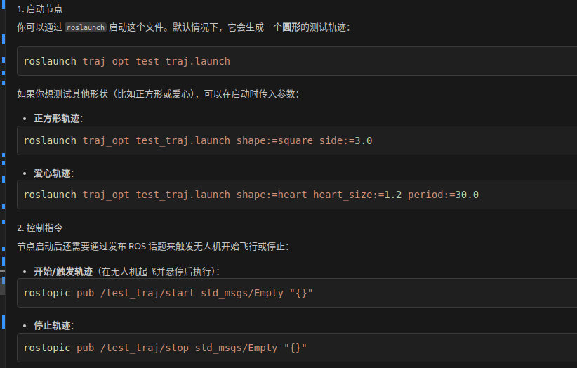
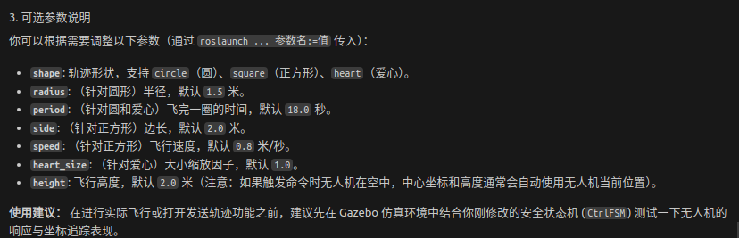
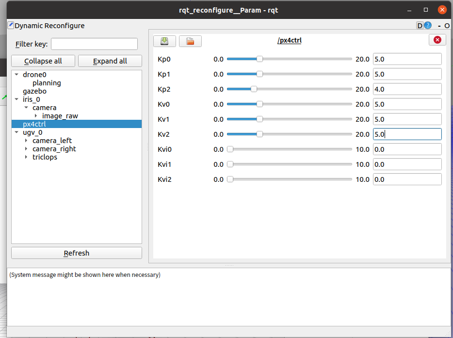

1. cd Fast-Perching
2. source devel/setup.bash
3. roslaunch planning perching.launch
4. cd sh_utils    ./pub_triger.sh
5. roslaunch fov_detection 

Fast-Perching论文提出的是一种激进的降落轨迹优化算法，如果想在实际应用，需要适当调整参数。例如降低时间权重、限制最大推力、最大速度、最大加速度！！！

rosrun planning move_ugv_square.py        让小车沿着矩形走一圈

**今日任务：图像检测**

1. 使用yolo11来检测目标小车，

使用Opencv检测aruco二维码，需要更改代码中定义的二维码尺寸，且相机距离太远也无法识别到
roslaunch perception_kcf markers_landpad_det.launch

使用的命令合集
1. roslaunch px4ctrl px4_sitl_outdoor.launch 
2. roslaunch px4ctrl joy_rcin.launch
3. python3 multirotor_communication.py iris 0
4. python3 get_local_pose.py iris 1
5. roslaunch px4ctrl px4ctrl_standalone.launch 

roslaunch planning  perching.launch

roslaunch perception_kcf markers_landpad_det.launch

rosrun plotjuggler plotjuggler 
rosrun rqt_reconfigure rqt_reconfigure

测试命令
<!-- 圆形轨迹（默认） -->
1. roslaunch traj_opt test_traj.launch

<!-- 正方形轨迹，边长3m，速度0.5m/s -->
2. roslaunch traj_opt test_traj.launch shape:=square side:=3.0 speed:=0.5

<!-- 圆形轨迹，半径2m，一圈12秒 -->
3. roslaunch traj_opt test_traj.launch shape:=circle radius:=2.0 period:=12.0

<!-- 指定中心位置 -->
4. roslaunch traj_opt test_traj.launch center_x:=1.0 center_y:=2.0

5. rostopic pub /test_traj/start std_msgs/Empty "{}" --once
6. rostopic pub /test_traj/stop std_msgs/Empty "{}" --once

解决一个bug，摄像头识别aruco二维码不准，最终发现是摄像头参数不对

