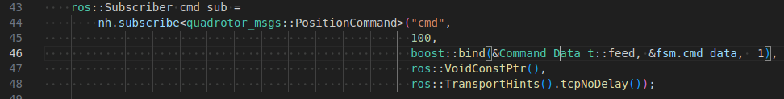
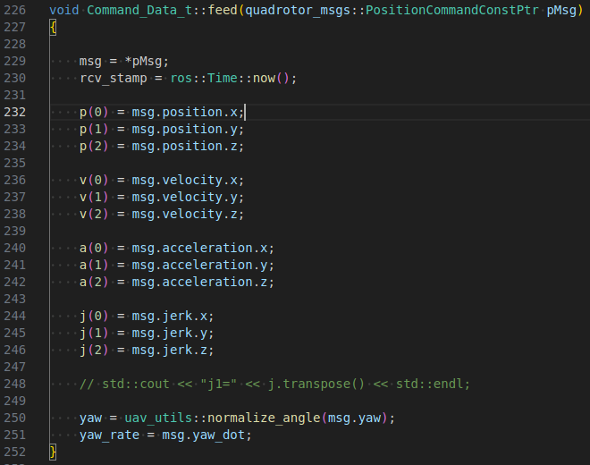
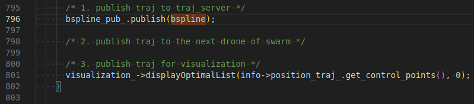
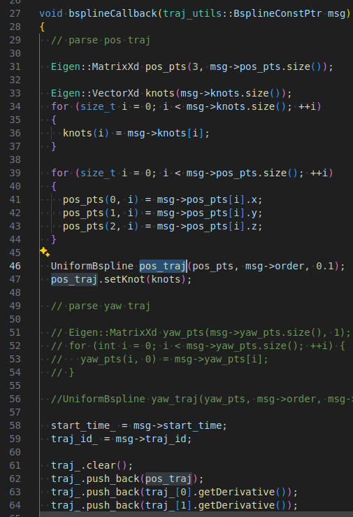
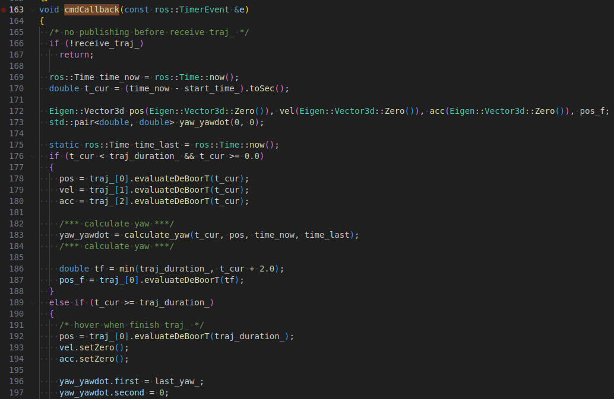
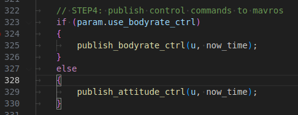

1. px4ctrl接受轨迹信息部分

    需要传递的数据组成-位置、速度、加速度、加加速度、偏航角、偏航角速度

3. 话题之间的关系
    Ego-Planner发布的话题
    Ego-planner规划器发布：
        /planning/bspline (类型: traj_utils::Bspline)
        包含B样条轨迹的控制点、节点向量等信息
    

    中间转换节点：traj_server
    关键中转站是
    traj_server.cppL242，它负责：
        订阅：/planning/bspline
        
        发布：/position_cmd (类型: quadrotor_msgs::PositionCommand)
        
    PX4Ctrl接收的话题
    PX4Ctrl(
        px4ctrl_node.cppL44)订阅：
        cmd 话题（相对话题名，实际为/position_cmd）
        类型：quadrotor_msgs::PositionCommand

4. px4ctrl中mavros控制部分
