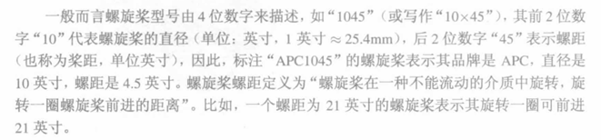

## 合计重量
1. 飞控 10g
2. 电调 14g
3. 机架 450g
4. 电池
5. 接收机
6. 桨叶
7. 机载电脑
8. GPS传感器
9. 电机 75x4g=300g

## 机架选择
1. 材料--碳纤维
2. 轴距--大小，轴距会限制螺旋桨的直径，小型无人机通常选用3叶桨
3. 扩展性，即安装传感器及机载电脑的点位和空间
    飞控、电调

## 飞控
1. 软件版本 PX4 
2. 硬件平台-支持的外设接口和数量
3. 支持的遥控器通信协议（重要）
4. 定位孔安装位置

## 遥控器及接收机
1. 支持的通信协议
2. 通道数
3. 通信距离

## 传感器
1. 视觉传感器-
2. 定位传感器-GPS

## 其他
1. 数传
2. BB响
3. 充电器、电源
4. 焊台
5. 螺丝刀
6. 万用表
7. 3M胶
8. 减震板
9. typec延长转接线
10. gps支架
11. 遥控器电池
13. 线材
14. 剥线钳
15. 电机钳（安装桨叶时，防割手）
 
## 动力系统

### 无刷电机选择
1. 考虑是选带橡胶头的还是直接焊线，如果电调选择四合一就是需要直接焊接，分体电调可以选择使用香蕉头，但香蕉头可能会脱落。
2. 电机尺寸 安装孔位 轴的长度
3. 电机的KV值：在空载时，每升高1V，电机每分钟转的圈数增加值
4. 电机轴可能会有方向,分正反牙，一般选用两正两反
5. 一般多旋翼无人机选用的电机都是平轴款，不选用后出轴。

### 电调
1. 四合一电调或分体电调
2. 载流大小，电压范围
3. 安装孔位、铜柱选择、螺母、焊接工具

### 桨叶
1. 考虑螺距和尺寸，
2. 选用非自锁桨叶或自锁桨叶，自锁桨叶需要电机轴与之方向相对应
3. 桨叶的单位是英寸，1英寸等于2.54厘米。

### 电池
1. 考虑续航和尺寸
2. 电池接口
