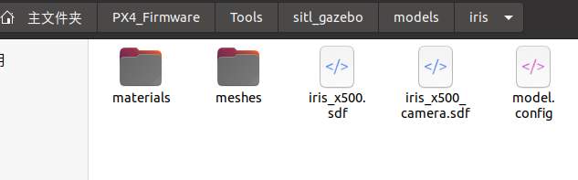
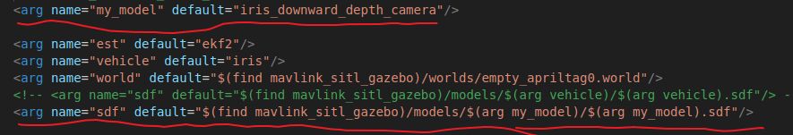

# PX4+Gazebo 自定义四旋翼模型

sdf格式——官方网址：http://sdformat.org/spec

## 标签介绍
```xml
<?xml version ?>  xml的版本  
<sdf version>  sdf的版本，和config里<sdf>的版本要保持一致
<model name> 模型的名字  
<pose> 在世界中的位置 x y z pitch yaw roll  
<static> 选择模型是否固定  
<link>链接 包含模型的一个主体的物理属性，尽量减模型中链接数量以提高性能和稳定  
<collision>: 用于碰撞检查，一个link可以有多个撞元素  
<geometry> 物体  
<box> | <sphere> | <cylinder>形状名字  
<size> x y z长度 | <radius>半径 | <radius> & <length>  
<surface> 平面  
<friction>设置地面摩擦力  
<ode> <mu> <slip>  
<visual>: 可视化  
<geometry> 几何形状  
<box>形状名字  
<size> x y z长度  
<inertial>: 惯性元素，描述了link的动态特性，例质量和转动惯量矩阵  
<mass> 质量  
<inertia> ！！！注意这两单词不一样呀  
<sensor>: 从world收集数据用于plugin  
<light>: 光源  
<joint>关节 关节连接两个link，用于旋转轴和关节限制等  
```

## 关键组件
1. **物理结构**  
    base_link：主体框架，包含质量、惯性参数和碰撞模型  
    rotor_X：四个旋翼，分别通过旋转关节连接  
    collision碰撞模型：简化几何体（立方体）用于高效碰撞检测 collision
2. **传感器系统sensor**  
    IMU：位于专用连杆，包含详细的噪声模型  
    GPS：通过<include>引入的外部模型  
    磁力计 & 气压计：通过插件模拟物理特性  
3. **控制插件plugin**  
    电机模型：模拟电机动力学（加速/减速时间常数）  
    多旋翼基础插件：计算总推力和力矩  
    MAVLink接口：与PX4飞控通信（UDP 14560端口）  
4. **可视化visual**  
    Dae/Stl网格：高保真3D模型渲染  
    材质贴图：飞控板等细节的纹理贴图  
    位姿调整：精确的部件定位（毫米级精度）  
5. **物理参数**  
    惯性张量：影响飞行动力学特性  
    电机常数：将转速转换为推力和扭矩  
    噪声模型：模拟真实传感器特性  

## 组成
一个无人机sdf模型通常包括的link组件为:  
```
base_link rotor_0 rotor_1 rotor_2 rotor_3
```
即一个机身加四个电机（包括电机基座）  
模型文件在meshes目录下  
贴图/纹理文件在material目录下  

## 替换模型
如果想要新建一个模型，最好根据已有模型进行更改，这样不容易出错。
下面展示了在备份了原有的iris模型后，我直接把原有的iris模型更改为x500的模型，并在里面添加x500没有的imu以及一个深度摄像头depth_camera。
  

首先要弄清楚launch文件中指定的sdf文件，与iris等模型文件下的sdf文件以及model.config之间的关系，另外若是全新的机架（airframe），还需要在ROMFS/px4fmu_common/init.d-posix/airframe中添加自己的机架配置文件以及相应的参数。

1. launch文件中使用两个参数决定要加载哪个模型
   
2. sdf文件 
   记住一点：使用少一点link，即尽量将link变成其他一些link当中的collision和visual等元素来表述这些物体，而不是单独作为一个link来表述物体，这样稳定性和表现会更好  
   
   设置model.sdf时，遵循以下顺序比较好：  
    1. Add a **link**.  
    2. Set the **collision** element.  
    3. Set the **visual** element.  
    4. Set the **inertial** properties.  
    5. Go to #1 until all links have been added.
    6. Add all joints (if any).  
    7. Add all plugins (if any).    
也就是：LCVIJP  
   

3. model.config是一个 XML 配置文件，用于提供关于模型的基本元数据信息，比如名称、版本号、作者等。
```xml
<?xml version="1.0"?>
<model>
  <name>3DR Iris</name>
  <version>1.0</version>
  <sdf version='1.6'>iris_x500.sdf</sdf>

  <author>
   <name>Lorenz Meier and Thomas Gubler</name>
   <email>lorenz@px4.io</email>
  </author>

  <description>
    This is a model of the 3DR Iris Quadrotor. The original model has been created by
    Thomas Gubler and is maintained by Lorenz Meier.
  </description>
</model>
```