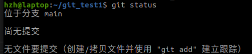

## 基础命令
```bash
git clone #克隆一个远程仓库到本地
git branch #管理分支
git checkout #切换分支
git add  #添加文件到暂存区
git push #将本地更改推送到远程仓库
```

现在在github上创建仓库时，**默认主分支名称为main**，并且可以选择创建一个README.md文件。
而如果在本地直接使用git init初始化仓库，默认主分支名称为master。可以使用如下命令指定分支名称  
```bash
git init -b main
```

首先先配置好用户名和邮箱

## 第一种情况：个人创建仓库
1. 先在自己（管理员权限）的github上创建好一个仓库，然后git clone到本地。这时候这个本地仓库已经和远程仓库有关联了，因此后续我们可以直接往这个远程仓库push代码。


2. 另一种做法：先在本地用git init初始化一个本地仓库，然后使用remote命令与远程仓库建立连接
    ```bash
    mkdir git_test1
    cd ~/git_test1
    git init -b main
    git status
    git branch
    ```
    此时如果使用git status会看到以下信息
    但使用git branch不会输出任何信息，是无法显示main分支的，因为此时本地仓库中还未提交任何文件！！！  
    故先创建一个README.md文件，然后提交本地仓库(这一步目的是让仓库有一个提交信息，若提交完后再删除还是可以查看、创建分支)
    ```bash
    vim README.md #保存后退出
    git add README.md
    git commit -m "add README.md"
    ```
    此时再使用git branch命令就可以看到main分支了，然后才可以去创建其他分支！！！
    ```bash
    git branch #查看分支
    git checkout -b <分支名> #创建分支并切换到这个分支上
    git branch
    ```

    与远程仓库建立连接。这个命令的作用是指定本地仓库与某个远程仓库git@github.com:xxx.git的连接，然后给这个仓库取了个别名origin。     
    注意这个命令没有检查仓库地址是否存在，你需要确保仓库地址存在且你有权限，后续你才能push代码。
    ```bash
    git remote add origin_hzh git@github.com:xxx.git
    ```
3. 添加文件到暂存区、提交到本地仓库、推送到远程仓库
   ```bash
   git status #查看未暂存、未提交的文件
   git add .  #添加所有没有暂存的文件到暂存区
   git add path/to/file   # 或者添加特定文件
   git commit -m "你的提交记录"
   ```
    最后，推送本地更改到远程仓库的指定分支。这里假设远程仓库名为 origin，而你要推送的分支名为 target-branch-name  
    `git push origin target-branch-name`
    如果是第一次推送到远程仓库，或者远程仓库没有该分支，则可能需要设置 upstream（上游），Git 会提示你执行相应命令，通常是这样： 
    `git push --set-upstream origin target-branch-name`
    或者简写为：
    `git push -u origin target-branch-name`